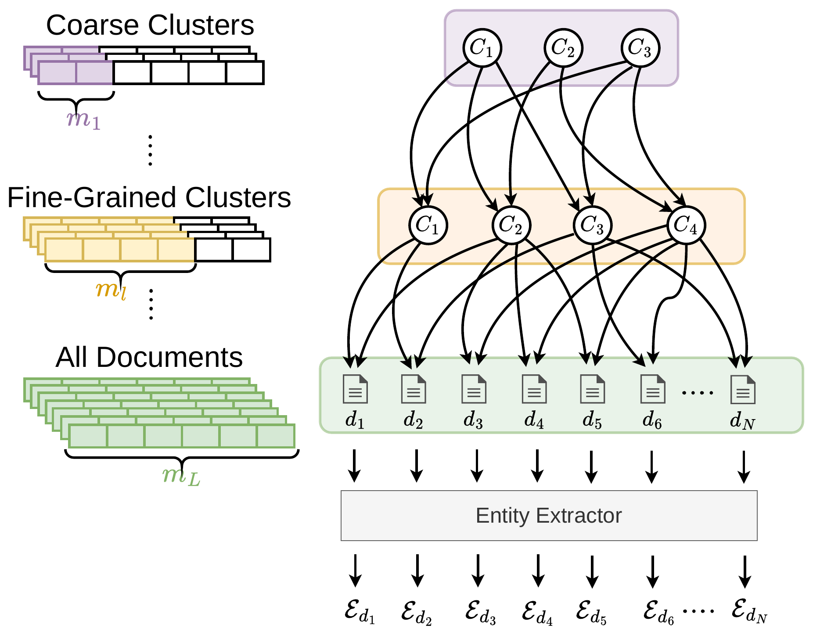
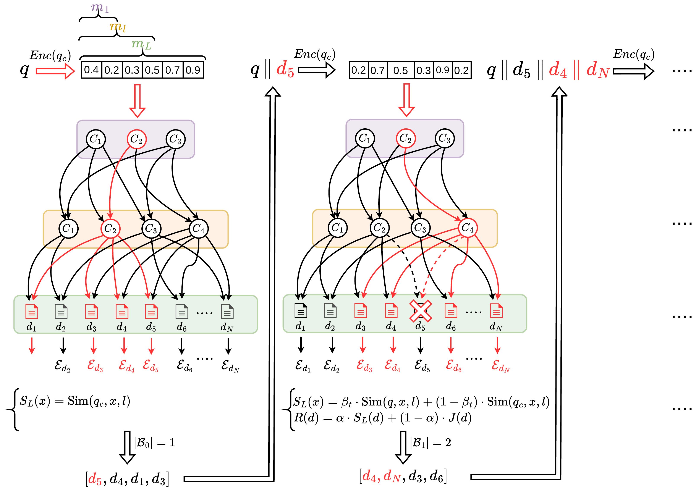

# MatRAG

This is the official implementation of the paper: **A Matryoshka Hierarchical RAG for Efficient Multi-Hop Question Answering**.

## Abstract

Retrieval-Augmented Generation (RAG) systems for multi-hop Question Answering (QA) must balance retrieval quality with computational cost. This cost is incurred during indexing time, through the use of expensive Knowledge Graphs (KGs) and Large Language Models (LLMs) to generate summaries, or during querying, through iterative LLM-driven retrieval. To reduce it while maintaining retrieval quality, we present MatRAG, a hierarchical framework that combines RAG systems with Matryoshka Representation Learning (MRL). MatRAG addresses both kinds of cost by aligning the semantic hierarchy of a clustering structure with the nested structure of MRL. Specifically, it organizes the corpus of documents into a Directed Acyclic Graph (DAG) of clusters with progressively coarser granularity. Each level is indexed at a shorter Matryoshka dimension. At query time, MatRAG pairs an iterative, top-down traversal of the DAG with an entity-driven mechanism that controls the hop budget and re-ranks candidates. We evaluated MatRAG on three standard multi-hop QA benchmarks against seven representative baselines. We found that MatRAG outperforms its strongest competitors in terms of retrieval quality; furthermore, it reduces indexing costs by avoiding KG construction and LLM-based summarization, and lowers query-time costs through dimension-aware similarity.

## Overview

MatRAG works in two phases: an offline indexing phase, shown in [Figure 1](#indexing-offline), and an online retrieval phase, shown in [Figure 2](#retrieval-online).

### Indexing (offline)

*Figure 1: Hierarchical indexing of the corpus.*

The corpus is encoded using a Matryoshka embedding model and organized from the bottom up into a hierarchical DAG via HDBSCAN with overlapping cluster assignments. The internal nodes are progressively coarser cluster centroids stored at shorter Matryoshka prefixes. The leaf layer retains full-dimensional document embeddings. Named entities are extracted from each document and stored with the embeddings. This allows for retrieval using both semantic and entity-level information.

### Retrieval (online)

*Figure 2: Entity-budgeted, iterative top-down retrieval.*

**Entity-budgeted retrieval (online).** Retrieval involves an iterative, top-down traversal of the hierarchy. Starting with the coarsest level, the query is scored against cluster centroids. At each level, the search space narrows to the most promising cluster until reaching the document level. The traversal score considers both similarity to the original query and similarity to the cumulative query. The latter incorporates previously retrieved documents to guide multi-hop reasoning while limiting query drift. At the leaves, candidates are re-ranked using a score that blends semantic similarity and entity overlap to prioritize documents that are both relevant and entity-consistent.

## Citation

If you use this code for your research, please cite our paper.
